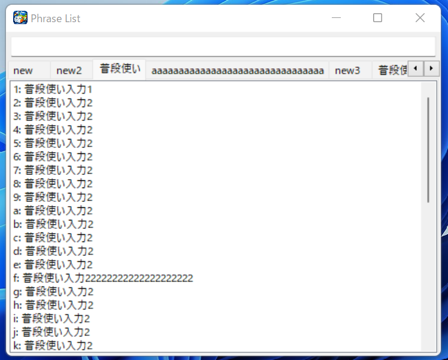
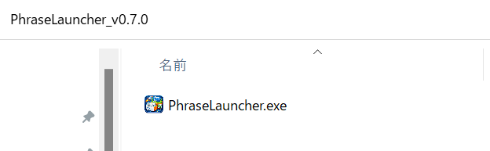
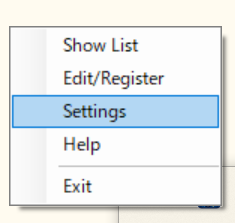
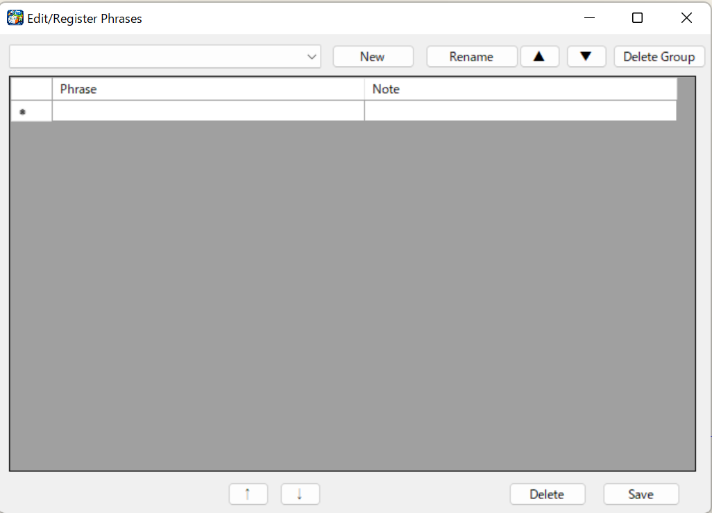
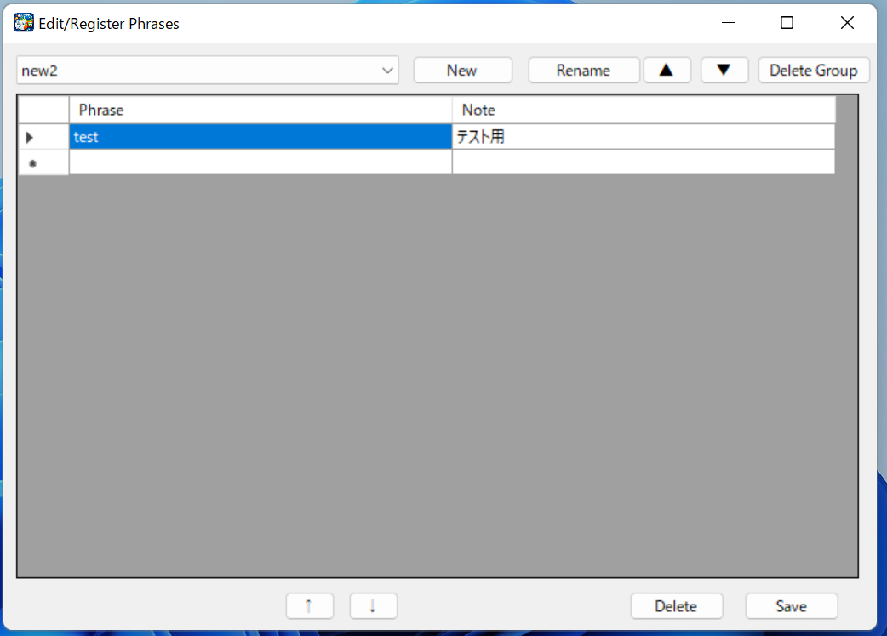
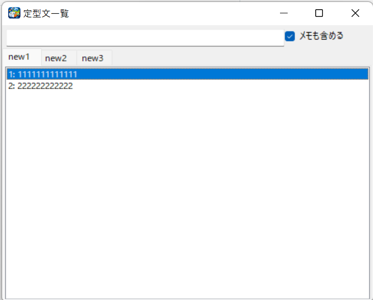
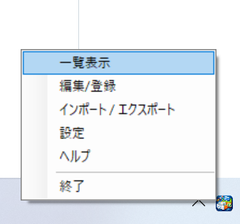
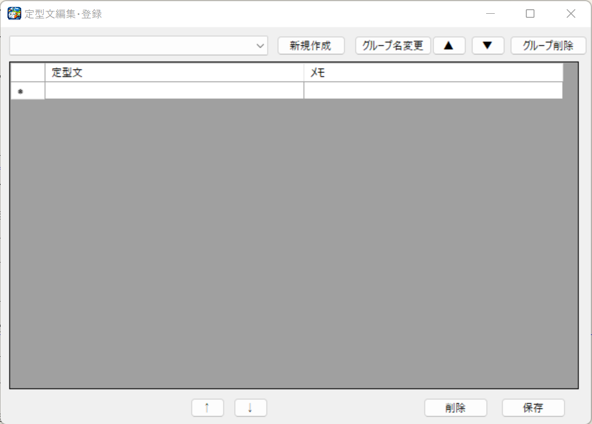

# PhraseLauncher

A phrase launcher that lets you input predefined text quickly.

On Windows, you can use **Windows key + V** to access clipboard history and pin items.  
However, it has several limitations:

1. The number of items you can register is limited  
2. It is not specialized for predefined phrases  
3. You cannot input phrases quickly using shortcuts (you need to use the mouse or scroll to select)  
4. You cannot organize phrases into groups  

Because of these frustrations, I created a tool specifically designed for predefined phrases.  

This software is **freeware** and can be used at no cost.  

---

## Demo

---

## System Requirements
- Windows 11 / Windows10

---

## How to Use (Quick Start)

0. Download the latest version from the link below and extract it to any location:    
   https://github.com/takuyash/PhraseLauncher/releases  

     

1. Run the `.exe` file and the application will stay resident in the system tray.  

     

2. Right-click the system tray icon to open the settings screen.  
   You can choose either Japanese or English as the display language.  
   
     

3. You can register groups and standard phrases from the edit registration screen, so please register them.

     

4. Open the launcher using **double Ctrl** (configurable) or **Ctrl + Shift + O**.

5. Each displayed item has a key assigned to it, so you can input phrases instantly just by pressing the corresponding key—no mouse or cursor movement required.

---

## How to Launch
- Running the `.exe` file places the app in the system tray.  
- Right-click the tray icon to open the settings screen.  
- Press **Ctrl** twice in a row (configurable) or **Ctrl + Shift + O** to display the launcher.

---

## Features

### 1. Ultra-Fast Input with 0–9 + A–Z Key Assignments
Displayed phrases are automatically assigned keys from **0–9** and **A–Z**.  
Pressing the corresponding key instantly inserts the phrase.

### 2. Easy Activation with Double Ctrl  
The launcher can be displayed using **double Ctrl** (configurable) or **Ctrl + Shift + O**.  
By default, it uses double Ctrl, but both the key type and the number of presses can be changed in the settings.  
You can also enable or disable hotkey activation entirely.

### 3. Keyword Search
Quickly search for phrases using keywords.

### 4. Phrase Editing and Registration
You can register and edit predefined phrases.  
Line breaks can be inserted using **Shift + Enter**.

### 5. Grouping Functionality
- Register, edit, delete, and reorder phrases by group  
- Edit, delete, and reorder group names  

### 6. No Unnecessary Settings
A simple application without redundant configuration options.

### 7. Simple, Fast, and Lightweight
- Clean and minimal UI  
- Extremely low rendering cost  
- Runs as a portable EXE  

### 8. Close the Launcher with the ESC Key
Press `Esc` to instantly close the launcher.

### 9. Available in Japanese and English
You can switch between Japanese and English in the settings screen.

### 10. Encryption Feature
You can save predefined phrases in an encrypted form.  
You can turn encryption on or off from the settings screen.  

### 11.Import and Export of Predefined Phrases
You can import and export predefined phrases.  
You can choose the format from CSV or JSON.  

---

## Screenshots

### Launcher Screen

### Phrase Registration Screen

---

## Updating the Application

To update, download the new version and overwrite the existing folder.

**Update steps:**
1. Exit PhraseLauncher  
2. Download the new ZIP file  
3. Overwrite the existing folder  
4. Launch the application  

---

## Disclaimer
The author assumes no responsibility for any damages resulting from the use of this software.  
Please use it at your own risk.

---

## License and Terms of Use

This software is freeware.  
It is released under the MIT License.  
**It may be used free of charge for both personal and commercial purposes.**  
However, the author assumes no responsibility for any damages that may occur as a result of using this software.  
Please use it at your own risk.  

---

## Support
If you find this software helpful,  
a ⭐ **Star** or 👀 **Watch** on GitHub would be greatly appreciated and very motivating!

Feedback and issues are always welcome.  

  
# PhraseLauncher(フレーズランチャー)

定型文を素早く入力できる定型文ランチャー

Windowsでは、Windowsキー + Vでクリップボードの履歴の入力やピン留めができますが  
1. 登録できる数が少ない  
2. 定型文特化でない  
3. ショートカットによる素早い入力ができない(マウスや、スクロールして選んで入力)  
4. グループ分けできない  
などの不満があったため定型文に特化したツールを自作しました。  

本ソフトウェアはフリーソフトですので無料で使用することができます。  

## 画面動作
     
   
## 動作環境
Windows 11

## 使い方（クイックスタート）
0. 下記から最新バージョンをダウンロードし、任意の場所に解凍します  
   https://github.com/takuyash/PhraseLauncher/releases  
   
     

1. exe を実行するとタスクトレイに常駐します  

     

2. タスクトレイのアイコンを右クリックして、設定画面が開けます
   言語は日本語と英語が選べるため好きなほうを選んでください。  
   
        

3. 編集登録画面からグループの登録や定型文の登録ができるので登録を行ってください。  
   
        
   
4. Ctrl 2回連続(設定で変更できます) もしくは Ctrl + Shift + O のショートカットでランチャーを呼び出すことができます  

5. 表示された項目にキーが割り当てられているためそのキーを入力することでマウスやカーソル移動することなく入力できます

## 起動方法
・exeを実行すると、タスクトレイに常駐します。  
・タスクトレイのアイコンを右クリックして、設定画面が開けます。  
・Ctrl 2回連続(設定で変更できます) もしくは Ctrl + Shift +  O で表示できます。  

## 特徴
1. 定型文に0–9 + A–Z のキー割り当てで超高速入力  
表示された項目には自動で 0〜9、A〜Z のキーが割り当てられます。  
そのキーを押すことで高速に入力できます。  

2. Ctrl 2回連続で簡単に起動  
ランチャー画面は、Ctrl 2回連続(設定で変更できます) もしくは Ctrl + Shift + O で表示できます。  
デフォルトではCtrlキー2回連続ですが、キーの種類と回数は設定で変更できます。  
また、ホットキーでの起動のオンオフの変更もできます。  

3. キーワード検索機能  
キーワードによる検索ができます。  

4. 定型文編集登録機能  
Shift + Enter で改行も入力できます。  

5. グループ分け機能  
・グループごとに定型文の登録、編集、削除、並び替えができます。  
・グループ名の編集や削除、並び替えもできます。  

6. 不要な設定がない  
不要な設定機能がないシンプルなアプリです。  

7. シンプル高速・軽量動作  
・シンプルなUI  
・描画コスト極低  
・ポータブル EXE で動作  

8. escキーでランチャー画面を閉じる  
ランチャー画面を閉じる時もescキーですぐに閉じることができます。  

9. 日本語と英語で使用可能  
設定画面で日本語と英語の切り替えが可能です。 

10. 暗号化機能  
定型文を暗号化して保存することができます。  
暗号化のオンオフは設定画面から切り替えることができます。  

11. 定型文のインポート、エクスポート  
定型文のインポート、エクスポートができます。  
形式は、CSVとJSON形式から選べます。  

## 画面
### ランチャー画面  
     

### 定型文登録画面  
     

## アプリ更新方法
更新時は新しいバージョンをダウンロードして既存フォルダに上書きしてください。  
アップデート方法  
1. PhraseLauncherを終了する  
2. 新しいzipファイルをダウンロード  
3. 既存フォルダに上書きする  
4. 起動する  

## 免責事項

本ソフトウェアを使用したことによって生じたいかなる損害についても、作者は一切の責任を負いません。  
自己責任でご利用ください。  

## ライセンス・利用条件

本ソフトウェアはフリーソフトです。  
MIT License のもとで公開されています。  
**個人利用・商用利用を問わず、無料で使用することができます。**
ただし、本ソフトウェアを使用したことによって生じたいかなる損害についても、作者は一切の責任を負いません。  
自己責任でご利用ください。  

## 応援について

もしこのソフトウェアが役に立ったと感じたら、
GitHub の ⭐ Star や 👀 Watch を付けてもらえるととても励みになります！

フィードバックや Issue も大歓迎です。
